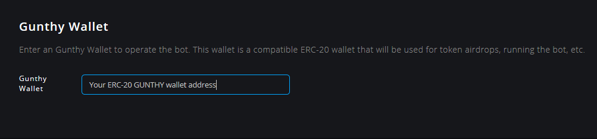
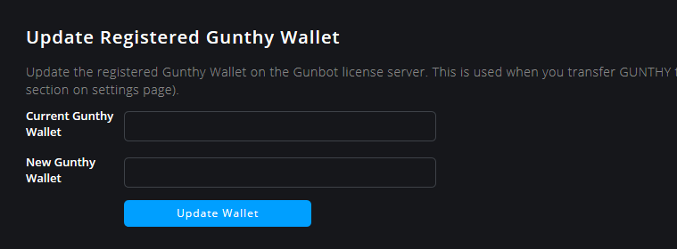

# تسجيل محفظة GUNTHY

يستخدم Gunbot نظام التحقق من الترخيص القائم على blockchain. ويستخدم الرمز المميز الخاص بـ ERC-20 والذي يسمى "GUNTHY". باستخدام هذا النظام ، يمكنك إدارة مفاتيح API الخاصة بك وتغييرها في أي وقت ، أو حتى بيع ترخيصك لطرف ثالث.

عنوان المحفظة الخاص بك ، جنبا إلى جنب مع كمية العملات الموزعة عليك مجانا عند شراء النسخة، هو مفتاح ترخيص Gunbot الخاص بك.


**أنت مسؤول عن مفاتيح API الخاصة بك ومحفظة GUNTHY.**

يرجى تفهم أننا قد لا نكون قادرين على مساعدتك إذا فقدت جميع مفاتيح API المسجلة الخاصة بك و \(الوصول إلى\) عنوان المحفظة الخاص بك. تأكد من اتباع جميع النصائح الأمنية عند إعداد المحفظة وحفظ مفتاح \(مفاتيح\) API المستخدم في Gunbot ونسخه احتياطيًا بشكل صحيح.


## تسجيل مفاتيح API إلى عنوان محفظة GUNTHY


يقوم المستخدمون الجدد بتسجيل عنوان المحفظة ومفاتيح API في وقت الشراء.

في هذه الحالة ، يجب عليك فقط إدخال عنوان المحفظة ومفاتيح API في Gunbot.


بعد تسجيل الموزع \(Reseller\) الخاص بك [مفتاح API](https://github.com/GuntharDeNiro/BTCT/wiki/api) ليتم استخدامه في Gunbot ، يمكنك التحكم وتحديثه بنفسك.

**الخطوة 1: يقوم الموزع بتسجيل مفتاح API الخاص بك ليتم استخدامه مع Gunbot.**

لكل ترخيص Gunbot ، يجب تسجيل API لمنصة واحدة في عنوان محفظة GUNTHY. إذا سمح لك الترخيص بفتحات \(Slots\) منصات متعددة  ، يمكنك تسجيل الباقي في أي وقت.

**الخطوة 2. إنشاء محفظة GUNTHY.**

عملة GUNTHY تستخدم ترميز ERC-20، وهذا يعني أن معظم محافظ Ethereum متوافقة معها. تحتاج إلى استخدام محفظة تملكها أي تملك مفتاحها الخاص \(Private Key\)، لن يعمل عنوان محفظتك في أي منصة.

استخدم هذا العقد الذكي لإضافة الرمز المميز GUNTHY إلى محفظتك:

[https://etherscan.io/address/0x3684b581db1f94b721ee0022624329feb16ab653](https://etherscan.io/address/0x3684b581db1f94b721ee0022624329feb16ab653)

عنوان العقد: `0x3684b581db1f94b721ee0022624329feb16ab653`

إذا طلب برنامج محفظتك معرفة عدد الكسور العشرية \(number of decimals\) التي سيتم استخدامها في GUNTHY ، فأدخل 18.

اقرأ المزيد حول [خطوات إنشاء محفظة GUNTHY.](https://github.com/GuntharDeNiro/BTCT/wiki/api-key-management#steps-to-create-a-gunthy-wallet)

**الخطوة 3 أ. أدخل مفتاح \(مفاتيح\) المنصة \(Exchange API\) الخاصة بك**

أدخل مفتاح \(مفاتيح\) المنصة في **الإعدادات\(Settings\)&gt; التداول\(Trading\)&gt; المنصات\(Exchanges\).**

في Gunbot ، استخدم مفتاح API المسجل كمفتاح رئيسي \(Master Key\). بشكل اختياري ، يمكنك استخدام مفتاح API ثانوي للتداول ، ويجب أن يكون هذا المفتاح موجودًا في نفس حساب المنصة الذي أصدرت منه الـAPI المسجل.

\*\*\*\*

**الخطوة 3 ب. تسجيل عنوان محفظة GUNTHY الخاص بك**

أدخل عنوان محفظة GUNTHY الخاصة بك في **إعدادات\(Settings\)&gt; تفضيلات\(Prefences\)&gt; محفظة جانثي\(Gunthy Wallet\).**

أدخل عنوان محفظة GUNTHY **الخاصة بك**. بعد ذلك ، يتم تسجيل جميع مفاتيح API على عنوان المحفظة هذا.

عند إضافة مفاتيح مسجلة إلى Gunbot بعد أن قمت بالفعل بتعيين عنوان المحفظة، يتم تسجيل المفاتيح الجديدة تلقائيًا في هذه المحفظة.

\*\*\*\*

**الخطوة 4. تسلم إنزال عملة جانثي\(توزيع مجاني GUNTHY Airdrop\)**

بعد تسجيل عنوان محفظتك، ستحصل على توزيع مجاني بالعدد المطلوب من عملة جانثي لنوع الترخيص الخاص بك. **احتفظ بهذه العملات طول الوقت للتأكد من أن Gunbot يمكنه أن يعمل، لأنه لن يستطبع العمل في حال خلو محفظتك من الكمية اللازمة منها.**

هذه هي الكميات المطلوبة لكل ترخيص:

* **Starter**: 400 GUNTHY
* **Standard**: 1000 GUNTHY
* **Pro**: 1500 GUNTHY
* **Ultimate**: 2500 GUNTHY

> خلال الطرح الأولي لنظام الترخيص الجديد، لم تكن عمليات الإنزال \(Airdrops\) أوتوماتيكية بعد. سوف يعمل Gunbot بدون الرصيد المطلوبالعملات في المحفظةرمزي حتى يتم اختبار هذه العملية بشكل كامل واختبارها.

## تحديث محفظة GUNTHY

إذا كنت بحاجة إلى التبديل إلى محفظة GUNTHY أخرى، فيمكنك تحديثها في **إعدادات\(Settings\)&gt; تفضيلات\(Prefences\)&gt; محفظة جانثي\(Gunthy Wallet\).**

سيتم تسجيل جميع مفاتيح API المسجلة المتصلة بعنوان المحفظة القديم في عنوان المحفظة الجديد بعد تحديثه.

