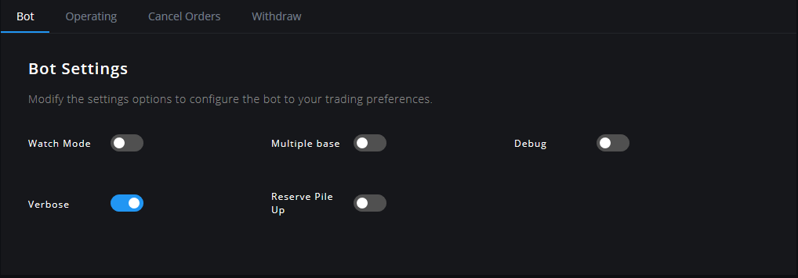

# إعدادات البوت

تتيح لك قائمة إعدادات البوت تغيير الإعدادات العامة التي تؤثر على جميع أزواج التداول.

لتغييرها، انتقل إلى إعدادات \(**Settings\)**&gt; إعدادات البوت \(**Bot Settings\)**.

## وصف الإعدادات

ستجد بالأسفل وصفًا مفصلاً لجميع المعلمات المتاحة \(available parameters\) لإعدادات البوت. تتوفر بعض الإعدادات المتقدمة فقط في ملف الإعدادات `config.js`.

### وضع المراقبة \(Watch Mode\)



اسم المعلمة \(Parameter name\) في ملف الإعدادات `config.js`: `WATCH_MODE`



**القيم:** true or false

**القيمة الافتراضية:** false



بتمكين هذا الخيار، سيقوم Gunbot بمعالجة الأزواج التي تم ضيطها وتفعيلها، ولكنه لن يضع أوامر شراء أو بيع فعلية. هذا الوضع جيد للاختبار.



### عملات أساسية متعددة \(Multiple Base\)



اسم المعلمة \(Parameter name\) في ملف الإعدادات `config.js`: `MULTIPLE_BASE`



**القيم:** true or false

**القيمة الافتراضية:** false



استخدم هذا الخيار للتداول في أزواج مع تقاطع بين عملة التسعير\(Quote\) والعملة الأساسية \(Base\) \(على سبيل المثال BTC-ETH وETH-ADA\). 

بتمكين هذا الخيار، لن يبيع Gunbot جميع وحدات عملة التسعير المتاحة عند البيع، وبدلاً من ذلك سيبيع الأموال المستثمرة فقط \(كما هو محدد في حد التداول\). يؤثر هذا الخيار أيضا على الوظيفة الإضافية TradingView.

 قم بتمكين هذا الخيار فقط عندما تحتاج إليه حقًا.



### تصحيح الأخطاء \(Debug\)



اسم المعلمة \(Parameter name\) في ملف الإعدادات `config.js`: `debug`



**القيم:** true or false

**القيمة الافتراضية:** false



بتمكين هذا الخيار، يُستخدم هذا الخيار لعرض رسائل التصحيح في البوت.

استخدم هذا الخيار فقط إذا كنت بحاجة إلى تصحيح شيء ما.



### المفصَّل \(Verbose\)



اسم المعلمة \(Parameter name\) في ملف الإعدادات `config.js`: `VERBOSE`



**القيم:** true or false

**القيمة الافتراضية:** false



تمكين هذا الخيار يؤدي إلى عرض معلومات أكثر تفصيلاً في شاشة التحكم.



### التراكم العكسي \(Reserve Pile Up\)



اسم المعلمة \(Parameter name\) في ملف الإعدادات `config.js`: `RESERVE_PILE_UP`



**Values:** true or false

**Default value:** false



بتمكين هذا الخيار، ستتم إضافة مكاسب التداول تلقائيًا إلى احتياطي الأموال، وسيتم إبقاؤها خارج التداول الإضافي.



### مهلة البوت \(Bot Delay\)



اسم المعلمة \(Parameter name\) في ملف الإعدادات `config.js`: `BOT_DELAY`



**القيم:** عددية، وتمثل الوقت بالثواني.

**القيمة الافتراضية:** 1



سيؤخر البوت معالجة زوج جديد لمدة محددة من الثواني.

وهذا الخيار مفيد عندما يطلب Gunbot البيانات بشكل أسرع مما يسمح به API المنصة القيام به. ونظرًا لأن المهلة المطلوبة تعتمد على عدد الأزواج والسرعة التي يحتاجها النظام الخاص بك لإدارة الأزواج، لا توجد قيم موصى بها.

هذا هو الإعداد العام لمهلة البوت، ويتم تجاهله عند تحديد مهلة محددة للمنصة.



### منظف البوت \(Bot CClean\)



اسم المعلمة \(Parameter name\) في ملف الإعدادات `config.js`: `BOT_CCLEAN`



**القيم:** عددية، وتمثل الوقت بالساعات.

**القيمة الافتراضية:** 2



هذا المعامل يقوم بإجبار التخزين المؤقت لـGunbot ليتم تنظيفه عن طريق إعادة تشغيل البوت كل X ساعة. 

لا يؤدي هذا الإعداد إلى تشغيل `TRADES_TIMEOUT`.

قم بتعيين هذا الخيار إلى قيمة منخفضة فقط عندما يواجه البوت الخاص بك بالفعل مشاكل تجعله يقف عن التداول بعد فترة استخدام طويلة.



### Interval Ticker Update











مهمل



### Period Storage Ticker











مهمل



### مهلة الشراء \(Timeout Buy\)



اسم المعلمة \(Parameter name\) في ملف الإعدادات `config.js`: `timeout_buy`



**القيم:** عددية، وتمثل الوقت بالمللي ثانية.

**القيمة الافتراضية:** 59000



هذه مهلة داخلية تمنع البوت من الشراء مرة أخرى خلال المدة المحددة من المللي ثانية بعد وضع أمر الشراء.



### مهلة البيع \(Timeout Sell\)



اسم المعلمة \(Parameter name\) في ملف الإعدادات `config.js`: `timeout_sell`



**القيم:** عددية، وتمثل الوقت بالمللي ثانية.

**القيمة الافتراضية:** 60000



هذه مهلة داخلية تمنع البوت من البيع مرة أخرى خلال المدة المحددة من المللي ثانية بعد وضع أمر بيع.



### إلغاء الطلبات ممكّنة \(Cancel Orders Enabled\)



اسم المعلمة \(Parameter name\) في ملف الإعدادات `config.js`: `CANCEL_ORDERS_ENABLED`



**القيم:** true or false

**القيمة الافتراضية:** false



بتمكين هذا الخيار، يقوم البوت بإلغاء الأوامر غير المعبأة أو المملوءة جزئيًا عندما يكون السعر قد ابتعد عن سعر الشراء أو البيع.

عطل هذا الخيار إذا كنت تتداول يدويًا لمنع البوت من إلغاء أوامرك المفتوحة. 

محاكاة أمر التنفيذ أو الإلغاء: **\(FOK\)** \(**Simulated Fill Or Kill\)**

عندما لا يتم ملء الأمر ما أو يتم ملؤه جزئيا، فسيتم إلغاؤه، سيحاول Gunbot ملء الأمر عن طريق استبدال بهذا الأمر بأمر آخر على سعر الطلب/العرض الحالي.

 بالنسبة لأوامر الشراء، هذا يعني أنه يتم إرسال أوامر FOK طالما أن عدد وحدات عملة التسعير\(Quote\) المحتفظ بها أقل من `TRADING_LIMIT`، وأن الفرق أكبر من `MIN_VOLUME_TO_BUY`. 

وبالنسبة لأوامر البيع، هذا يعني أنه يتم إرسال أوامر FOK طالما أن عدد وحدات عملة التسعير\(Quote\) المحتفظ بها \(مطروحا منها `KEEP_QUOTE`، إذا تم استخدامها\) أكثر من `MIN_VOLUME_TO_SELL`، وأن عرض التسعير \(bid \)  أعلى من نقطة التعادل \(break-even point\).



### سقف دورة إلغاء الأوامر \(Cancel Orders Cycle Cap\)



اسم المعلمة \(Parameter name\) في ملف الإعدادات `config.js`: `CANCEL_ORDERS_CYCLE_CAP`



**القيم:** عددية، وتمثل عدد الجولات

**القيمة الافتراضية:** 10



ينطبق هذا الخيار عند استخدام `MAKER_FEES` فقط. 

اضبط عدد الجولات التي يجب أن تظل الأوامر المعلقة مفتوحة. بعد مرور هذا العدد من الجولات ، سيقوم Gunbot بإلغاء الأمر المعلق.



### عنوان السحب \(Withdraw Address\)



اسم المعلمة \(Parameter name\) في ملف الإعدادات `config.js`: `withdraw_address`



**القيم:** string

**القيمة الافتراضية:** YOURBTCADDRESSHERE



قم بتعيين عنوان محفظة BTC صالح لتمكين عمليات السحب التلقائية في كل مرة يتم فيها الوصول إلى الحد. 

يرجى استخدام هذه الميزة على مسؤوليتك الخاصة فقط.



### حد السحب \(Withdraw Threshold\)



اسم المعلمة \(Parameter name\) في ملف الإعدادات `config.js`: `withdraw_threshold`



**القيم:** عددية، وتمثل الكمية بال BTC

**القيمة الافتراضية:** 0.5



يضبط مقدار BTC ليتم تجميعه مع `RESERVE_PILE_UP` قبل تنفيذ السحب التلقائي.



