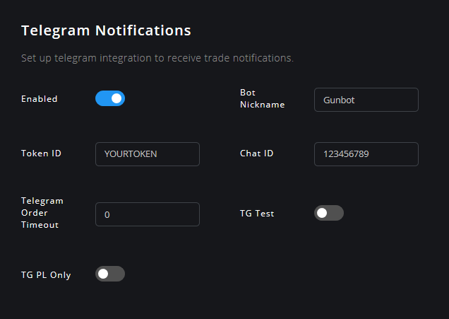

# إشعارات التليجرام \(Telegram\)

يمكن لـ Gunbot إرسال إشعارات على Telegram لكل تداول يقوم به.

لإعداد هذا ، انتقل إلى الإعدادات \(**Settings\)** &gt; التليجرام  **\(Telegram\)**.

## خطوات إنشاء بوت Telegram

تعمل الإشعارات أولا من خلال إنشاء بوت شخصي على Telegram، ثم يتصل Gunbot بهذا البوت لدفع الإشعارات إليك.

هذه هي الطريقة لإنشاء البوت:

1. افتح محادثة مع [@botfather](https://telegram.me/botfather). ثم قم بإنشاء بوت جديد باستخدام الأمر /newbot واختر اسمًا واسمًا للمستخدم للبوت الخاص بك \(username\)، ثم احفظ رمز البوت \(Token Id\).
2. افتح محادثة مع [@myidbot](https://telegram.me/myidbot) لرؤية معرف الدردشة الخاصة بك \(Chat ID\) ثم قم بحفظه.
3. قم بتمكين إشعارات Telegram لـ Gunbot، وأدخل رمز البوت \(Token Id\) ومعرف الدردشة \(Chat ID\) الذي جمعته منذ قليل.
4. ابدأ محادثة باستخدام اسم المستخدم الذي اخترته لبوتك \(username\)، ثم اضغط على زر البدء. إذا كنت لا ترى زر البدء ، فاكتب "/start" ثم انقر فوقه.

## وصف الإعدادات

ستجد بالأسفل وصفا مفصلا لجميع المعلمات المتاحة \(available parameters\) لإخطارات Telegram.

### مفعل \(Enabled\)



اسم المعلمة \(Parameter name\) في ملف الإعدادات `config.js`: `TELEGRAM_ENABLED`



**القيم:** true or false

**القيمة الافتراضية:** false



تمكين هذا لجعل Gunbot يرسل إشعارات التداول عبر Telegram.



### اسم الشهرة \(Bot Nickname\)



Each trade notification starts with the nickname set here.

Use this to easily check from which bot instance the notifications have been sent.



**Values:** string

**Default value:** Gunbot



Parameter name in `config.js`: `TELEGRAM_NICK`



يبدأ كل إخطار تداول باسم الشهرة الذي يتم تعيينه هنا.

استخدم هذا لتتحقق بسهولة من أي من نسخة bot التي ترسل الإشعارات.



### Token



The Telegram token for your bot.



**Values:** string

**Default value:** YOURTOKEN



Parameter name in `config.js`: `TOKEN`



### Chat ID



The Chat ID for your bot to send its messages to.

**Valid options:**

_**"12345"**_

A positive integer, to send messages directly to a telegram user. Use this method when you just want to receive notifications for your personal use.

To find your telegram id, send /start to @MyTelegramID\_bot and it will respond with your ID.

_**"-12345"**_

A negative integer, to send messages to a group chat.

The easiest way to obtain a groups id, is to open [https://web.telegram.org](https://web.telegram.org) login, and navigate to the group. Now pay attention to the URL, you should see something like [https://web.telegram.org/\#/im?p=g12345](https://web.telegram.org/#/im?p=g12345) - the number after the p=g part is the group id.

This must be listed in chat\_id with a - symbol in front, in this case "-12345"



**Values:** string

**Default value:** 123456789



Parameter name in `config.js`: `chat_id`



### TG PL Only



When enabled notifications will be only sent for strategy sell orders.



**Values:** true or false

**Default value:** false



Parameter name in `config.js`: `TG_PL_ONLY`



### Telegram Order Timeout



When set above 0, you'll receive a Telegram dialog to manually allow or deny every order Gunbot wants to place.

During the set amount of seconds you can choose to allow the order \(and it will immediately be placed\) or deny it. After the timeout passes without reply, the order will be placed at the exchange.



**Values:** numerical, represent time in seconds.

**Default value:** 0



Parameter name in `config.js`: `TG_PL_ONLY`



### TG Test



Enable this to test if your Telegram bot is working.

A test message will be sent on the first round for each pair. Disable after verifying your bot works.



**Values:** true or false

**Default value:** false



Parameter name in `config.js`: `TG_TEST`



